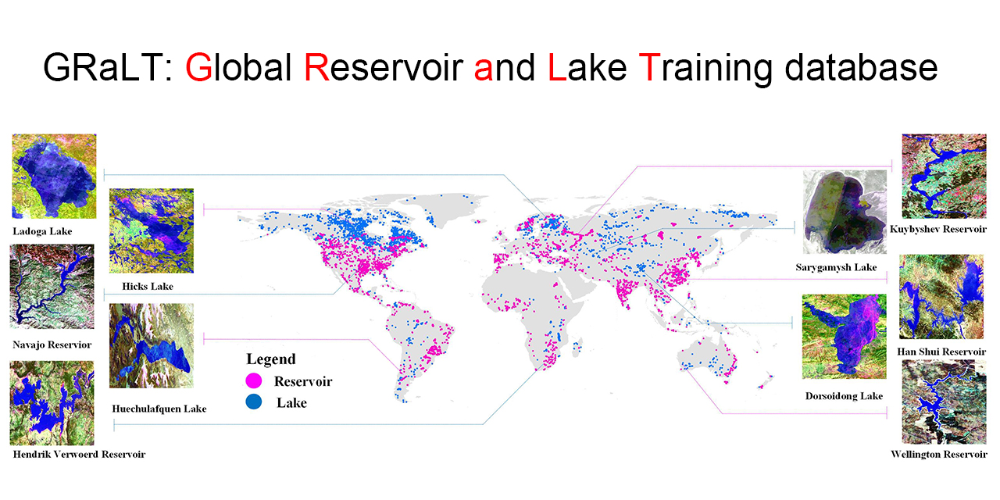

# GRaLT: Global Reservoir and Lake Training database

## Introduction

Man-made reservoirs are key components of terrestrial hydrological systems. Identifying the location and number of reservoirs is the premise for studying the impact of human activities on water resources and environmental changes. 78% of the world's surface water comes from reservoirs and lakes. Here we established a Global Reservoir and Lake Training database clipped from moderate resolution Landsat 8 images for using deep learning method to identify waterbody's type. The database is of free access for scientific and educational applications.

## Attributes

### Characteristics

<table border="0" cellpadding="0" cellspacing="0" width="794" style="border-collapse:
 collapse;table-layout:fixed;width:597pt"> 
 <caption>TABLE 1 CHARACTERISTICS OF THE GRALT</caption>
   <colgroup>
    <col width="72" style="width:60pt" /> 
    <col width="226" style="mso-width-source:userset;mso-width-alt:7232;width:170pt" /> 
    <col width="106" style="mso-width-source:userset;mso-width-alt:3392;width:85pt" /> 
    <col width="204" style="mso-width-source:userset;mso-width-alt:6528;width:60pt" /> 
    <col width="186" style="mso-width-source:userset;mso-width-alt:5952;width:60pt" /> 
   </colgroup>
   <tbody>
    <tr height="40" style="height:30.0pt"> 
     <td height="40" class="xl6522915" width="72" style="height:30.0pt;width:54pt;text-align:center;vertical-align:middle">Name</td> 
     <td class="xl6522915" width="226" style="width:170pt;text-align:center;vertical-align:middle">Band Combination</td> 
     <td class="xl6522915" width="106" style="width:80pt;text-align:center;vertical-align:middle">Resolution (m)</td> 
     <td class="xl6522915" width="204" style="width:153pt;text-align:center;vertical-align:middle">Number of training samples</td> 
     <td class="xl6522915" width="186" style="width:140pt;text-align:center;vertical-align:middle">Number of testing samples</td> 
    </tr> 
    <tr height="60" style="height:45.0pt"> 
     <td height="60" class="xl6622915" width="72" style="height:45.0pt;width:54pt;text-align:center;vertical-align:middle">Band all</td> 
     <td class="xl6622915" width="226" style="width:170pt;text-align:center;vertical-align:middle">Coastal \ Blue \ Green \ Red \ NIR \ SWIR 1 \ SWIR 2 \ Pan \ Cirrus \&nbsp; TIRS 1 \ TIRS 2</td> 
     <td rowspan="4" class="xl6722915" width="106" style="border-top:none;width:80pt;text-align:center;vertical-align:middle">30</td> 
     <td rowspan="6" class="xl6722915" width="204" style="border-bottom:1.0pt solid black;
  border-top:none;width:153pt">3040</td> 
     <td rowspan="6" class="xl6722915" width="186" style="border-bottom:1.0pt solid black;
  border-top:none;width:140pt">760</td> 
    </tr> 
    <tr height="20" style="height:15.0pt"> 
     <td height="20" class="xl6622915" width="72" style="height:15.0pt;width:54pt;text-align:center;vertical-align:middle">Band 543</td> 
     <td class="xl6622915" width="226" style="width:170pt;text-align:center;vertical-align:middle">Green \ Red \ NIR</td> 
    </tr> 
    <tr height="20" style="height:15.0pt"> 
     <td height="20" class="xl6622915" width="72" style="height:15.0pt;width:54pt;text-align:center;vertical-align:middle">Band 654</td> 
     <td class="xl6622915" width="226" style="width:170pt;text-align:center;vertical-align:middle">Red \ NIR \ SWIR 1</td> 
    </tr> 
    <tr height="40" style="height:30.0pt"> 
     <td height="40" class="xl6622915" width="72" style="height:30.0pt;width:54pt;text-align:center;vertical-align:middle">Water Contour</td> 
     <td class="xl6822915" width="226" style="width:170pt;text-align:center;vertical-align:middle">MNDWI &gt; 0</td> 
    </tr> 
    <tr height="20" style="height:15.0pt"> 
     <td height="20" class="xl6622915" width="72" style="height:15.0pt;width:54pt;text-align:center;vertical-align:middle">Band 8</td> 
     <td class="xl6622915" width="226" style="width:170pt;text-align:center;vertical-align:middle">Pan</td> 
     <td rowspan="2" class="xl6622915" width="106" style="border-bottom:1.0pt solid black;
  width:80pt;text-align:center;vertical-align:middle">15</td> 
    </tr> 
    <tr height="21" style="height:15.75pt"> 
     <td height="21" class="xl6922915" width="72" style="height:15.75pt;width:54pt;text-align:center;vertical-align:middle">Pan 654</td> 
     <td class="xl6922915" width="226" style="width:170pt;text-align:center;vertical-align:middle">Red \ NIR \ SWIR 1</td> 
    </tr>
   </tbody>
  </table>

### Distribution 
Fig.1 shows the distribution of the Global Reservoir and Lake Training database (The pink dots are reservoirs and the blue dots are lakes). Training and testing data (examples after resizing into 224×224 patches are given on the left and right sides of the figure): Lakes (Ladoga, Hicks, Taciula, Sarygamysh, Dorsoidong) and reservoirs (Navajo, Hendrik Verwoerd, Kuybyshev, Han Shui, Wellington) were all extracted from Landsat 8 TOA images with the buffered HydroLAKES layer.

 

## Download

You can download GRaLT-v1.0 from Baidu Drive, and it is of free access for scientific and educational applications.
* [GRaLT_v1.0-Non-resize](https://pan.baidu.com/s/1aL07F29VJ4GI_hsMhnEN-g) 
* [GRaLT_v1.0-Resize](https://pan.baidu.com/s/19QLR9kXlAzA5ogXNYHbYUA) 

## Authorship

This dataset is contributed by [Weizhen Fang](https://github.com/Weizhen-Fang), and many others (thanks to them!).

## Citation

    @article{
        Author = {Weizhen Fang, Cunguang Wang, Xi Chen, Wei Wan, Huan Li, Siyu Zhu, Yu Fang, Baojian Liu, Yang Hong},
        Title = {Recognizing global reservoirs from Landsat 8 images: A deep learning approach},
        Journal = {IEEE Journal of Selected Topics in Applied Earth Observations and Remote Sensing},
        Year = {2019}
    }
